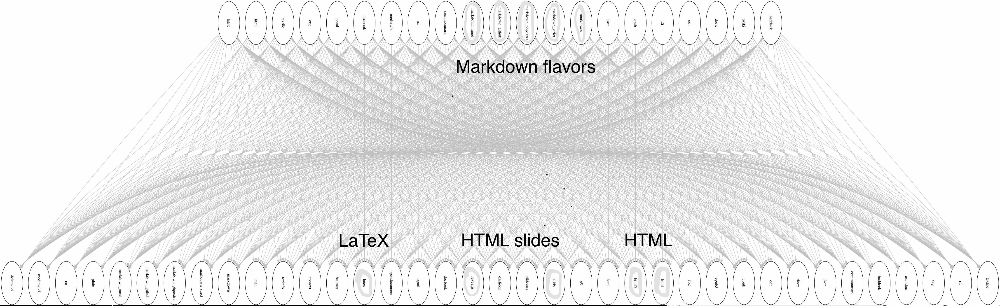

# Motivating literate programming

## Issues

How to

* organize your work?
* make work more pleasant for yourself? (less tedium, less manual, less ...) 
* reduce friction for collaboration?
* reduce friction for communication?
* make your work navigable, interpretable, and repeatable by others?

A lot of this can be built into the normal coding and analysis process by using specific tools and habits.

## Getting the analysis right is only one link

Process, packaging, and presentation are often the weak links in the chain.


# Markdown

## What is Markdown?

* Markdown is a particular type of markup language. Markup languages are designed to produce documents from plain text.
    * You may be familiar with _LaTeX_, another (though less human friendly) text markup language.
* Tools render markdown to different formats (for example, HTML/pdf/Word). 
    * The main tool for rendering markdown is [pandoc](http://johnmacfarlane.net/pandoc/)).

<p style="font-size: smaller;">Adapted from [Carson Sievert's markdown slides](http://cpsievert.github.io/slides/markdown/#/2).</p>

## Why Markdown?

* Easy to learn and use. Focus on _content_, rather than _coding_ and debugging _errors_.
* Easy to edit yet very flexible. Can add HTML, CSS, and JavaScript.
* The rendering process is through tools and is thus an automatable and repeatable process.
* Lends itself well to version control, collaboration, sharing, and reuse.

<p style="font-size: smaller;">Adapted from [Carson Sievert's markdown slides](http://cpsievert.github.io/slides/markdown/#/1).</p>

## Markdown enables fast publishing to the web

**Markdown**: Easy to write and read in an editor

**HTML**: Easy to publish and read on the web

## Markdown versus HTML code {.code-columns}

<pre class="codesample" style="width: 49%; margin-right: 0;">
This is a Markdown document.

## Medium header &lt;!-- header 2, actually --&gt;

It's easy to do *italics* or __make things bold__.

> All models are wrong, but some are useful. An approximate answer to the right problem is worth a good deal more than an exact answer to an approximate problem. 

Code block below. Just affects formatting here.

```
x <- 3 * 4
```

I can haz equations. Inline equations, such as the average is computed as $\frac{1}{n} \sum_{i=1}^{n} x_{i}$. Or display equations like this:

$$
\begin{equation*}
|x|= 
\begin{cases} x & \text{if $x\ge 0$,} \\\\
-x &\text{if $x\lt 0$.}
\end{cases}
\end{equation*}
$$
</pre>

<pre class="codesample" style="width: 49%; margin-left: 0.3em;">
&lt;!DOCTYPE html&gt;
&lt;html&gt;
&lt;head&gt;
&lt;meta http-equiv="Content-Type" content="text/html; charset=utf-8"/&gt;
&lt;title&gt;Title&lt;/title&gt;
&lt;!-- MathJax scripts --&gt;
&lt;script type="text/javascript" src="..."&gt;&lt;/script&gt;
&lt;style type="text/css"&gt;
body {
   font-family: Helvetica, arial, sans-serif;
   font-size: 14px;
...
&lt;/style&gt;
&lt;/head&gt;
&lt;body&gt;
&lt;p&gt;This is a Markdown document.&lt;/p&gt;

&lt;h2&gt;Medium header&lt;/h2&gt;

&lt;p&gt;It&#39;s easy to do &lt;em&gt;italics&lt;/em&gt; or &lt;strong&gt;make things bold&lt;/strong&gt;.&lt;/p&gt;

&lt;blockquote&gt;&lt;p&gt;All models are wrong, but some are...&lt;/p&gt;&lt;/blockquote&gt;
&lt;p&gt;Code block below. Just affects formatting here.&lt;/p&gt;

&lt;pre&gt;&lt;code&gt;x &lt;- 3 * 4
&lt;/code&gt;&lt;/pre&gt;
</pre>


## Markdown versus rendered HTML {.code-columns}

<pre class="codesample" style="width: 49%; margin-right: 0;">
This is a Markdown document.

## Medium header &lt;!-- header 2, actually --&gt;

It's easy to do *italics* or __make things bold__.

> All models are wrong, but some are useful. An approximate answer to the right problem is worth a good deal more than an exact answer to an approximate problem. 

Code block below. Just affects formatting here.

```
x <- 3 * 4
```

I can haz equations. Inline equations, such as the average is computed as $\frac{1}{n} \sum_{i=1}^{n} x_{i}$. Or display equations like this:

$$
\begin{equation*}
|x|= 
\begin{cases} x & \text{if $x\ge 0$,} \\
-x &\text{if $x\lt 0$.}
\end{cases}
\end{equation*}
$$
</pre>

<div class="right-column">
This is a Markdown document.

<h2>Medium header</h2>

It's easy to do *italics* or __make things bold__.

> All models are wrong, but some are useful. An approximate answer to the right problem is worth a good deal more than an exact answer to an approximate problem. 

Code block below. Just affects formatting here.

```
x <- 3 * 4
```

I can haz equations. Inline equations, such as the average is computed as $\frac{1}{n} \sum_{i=1}^{n} x_{i}$. Or display equations like this:

$$
\begin{equation*}
|x|= 
\begin{cases} x & \text{if $x\ge 0$,} \\\\
-x &\text{if $x\lt 0$.}
\end{cases}
\end{equation*}
$$
</div>


## Markdown can be rendered to multiple formats

* `pandoc` is a swiss-army knife tool for conversion

<div style="margin-top: 1.5em; margin-left: -20%; text-align: center;">

</div>

# R Markdown

## R Markdown is rendered to Markdown {.code-columns}

<pre class="codesample" style="width: 40%; margin-right: 0;">
This is an R Markdown document.

```&#123;r&#125;
x <- rnorm(1000)
head(x)
```

`knitr` offers a lot of control over representing different types of output. We can also have inline R expressions computed on the fly. The mean $\bar{x} = \frac{1}{n} \sum_{i=1}^{n} x_{i}$ of the &#96;r length(x)&#96; random variates we generated is &#96;r round(mean(x), 3)&#96;. This figure is computed on-the-fly as well. No more copy-paste, including for figures:

```&#123;r&#125;
plot(density(x))
```
</pre>

<pre class="codesample" style="width: 60%; margin-left: 0.3em;">
This is an R Markdown document.

```{r}
x <- rnorm(1000)
head(x)
```

`knitr` offers a lot of control over representing different types of output. We can also have inline R expressions computed on the fly. The mean $\bar{x} = \frac{1}{n} \sum_{i=1}^{n} x_{i}$ of the `r length(x)` random variates we generated is `r round(mean(x), 3)`. This figure is computed on-the-fly as well. No more copy-paste, including for figures:

```r
plot(density(x))
```

</pre>

## Ideas, code, and generated results tied together {.code-columns}

<pre class="codesample" style="width: 40%; margin-right: 0;">
This is an R Markdown document.

```&#123;r&#125;
x <- rnorm(1000)
head(x)
```

`knitr` offers a lot of control over representing different types of output. We can also have inline R expressions computed on the fly. The mean $\bar{x} = \frac{1}{n} \sum_{i=1}^{n} x_{i}$ of the &#96;r length(x)&#96; random variates we generated is &#96;r round(mean(x), 3)&#96;. This figure is computed on-the-fly as well. No more copy-paste, including for figures:

```&#123;r&#125;
plot(density(x))
```
</pre>

<div class="right-column" style="width: 60%">
This is an R Markdown document.

```{r}
x <- rnorm(1000)
head(x)
```

`knitr` offers a lot of control over representing different types of output. We can also have inline R expressions computed on the fly. The mean $\bar{x} = \frac{1}{n} \sum_{i=1}^{n} x_{i}$ of the `r length(x)` random variates we generated is `r round(mean(x), 3)`. No more copy-paste, including for figures:

```{r}
plot(density(x))
```
</div>

## Can be rendered interactively in RStudio

<div style="margin-top: 1em; text-align: center;">

</div>

## Rendering can be automated is thus repeatable

<div style="margin-top: 4em;"/>

From within R:
```r
rmarkdown::render("filename.Rmd")
```

From the command line:
```bash
$ Rscript -e "rmarkdown::render('filename.Rmd')"
```

## Summary

* R Markdown enables ideas and questions, the code that implements them, and the results generated by the implementation, to all stay together.

* R Markdown toolchain allows automated, repeatable rendering
    * for publishing to the web and viewing through a browser,
    * and (through LaTeX) to obtain a submittable manuscript (in PDF or Word).

* `knitr` is not limited to executing R code. See the book _Dynamic documents with R and knitr_ by Yihui Xie, part of the CRC Press / Chapman & Hall R Series (2013). ISBN: [9781482203530](http://www.isbnsearch.org/isbn/9781482203530).