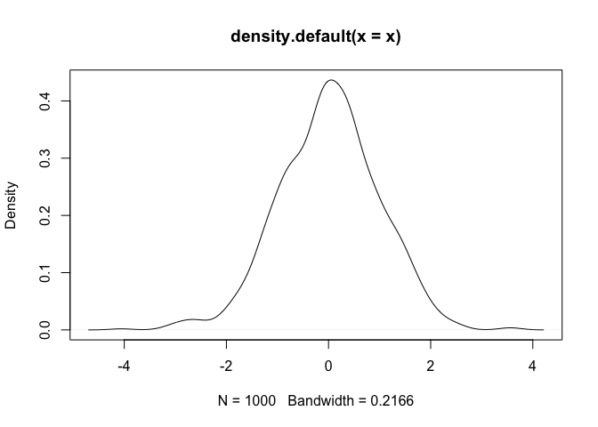
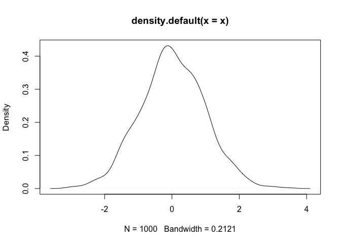
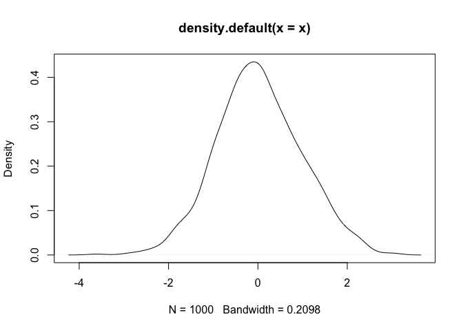

# Literate programming


> ## 2. Literate programming
> - Organize your work
> - make work more pleasant for yourself? (less tedium, less manual, less ...)
> - reduce friction for collaboration?
> - reduce friction for communication?
> - make your work navigable, interpretable, and repeatable by others?
{: .objectives}

#### Getting the analysis right is only one link

Process, packaging, and presentation are often the weak links in the chain.


## Markdown

### What is Markdown?
- `Markdown` is a particular type of markup language. Markup languages are designed to produce documents from plain text.
- You may be familiar with `LaTeX`, another (though less human friendly) text markup language.
- Tools render markdown to different formats (for example, HTML/pdf/Word).
  - The main tool for rendering Markdown is [pandoc](http://pandoc.org/).

Adapted from [Carson Sievert's markdown slides](http://cpsievert.github.io/slides/markdown/#/1)

### Markdown enables fast publication to the web
- **Markdown** Easy to write and read in an editor.
- **HTML** Easy to publish and read on web.

### Markdown versus HTML code {.code-columns}
~~~
This is a Markdown document.

## Medium header <!-- header 2, actually -->

It's easy to do *italics* or __make things bold__.

> All models are wrong, but some are useful. An approximate answer to the right problem is worth a good deal more than an exact answer to an approximate problem.

Code block below. Just affects formatting here.

```
x <- 3 * 4
```

I can haz equations. Inline equations, such as the average is computed as $\frac{1}{n} \sum_{i=1}^{n} x_{i}$. Or display equations like this:


$$
\begin{equation*}
|x|=
\begin{cases} x & \text{if $x\ge 0$,} \\\\
-x &\text{if $x\lt 0$.}
\end{cases}
\end{equation*}
$$


<!DOCTYPE html>
<html>
<head>
<meta http-equiv="Content-Type" content="text/html; charset=utf-8"/>
<title>Title</title>
<!-- MathJax scripts -->
<script type="text/javascript" src="..."></script>
<style type="text/css">
body {
   font-family: Helvetica, arial, sans-serif;
   font-size: 14px;
...
</style>
</head>
<body>
<p>This is a Markdown document.</p>

<h2>Medium header</h2>

<p>It's easy to do <em>italics</em> or <strong>make things bold</strong>.</p>

<blockquote><p>All models are wrong, but some are...</p></blockquote>
<p>Code block below. Just affects formatting here.</p>

<pre><code>x <- 3 * 4
</code></pre>
~~~

 

### Markdown versus rendered HTML {.code-columns}

This is a Markdown document.

## Medium header <!-- header 2, actually -->

It's easy to do *italics* or __make things bold__.

> All models are wrong, but some are useful. An approximate answer to the right problem is worth a good deal more than an exact answer to an approximate problem.

Code block below. Just affects formatting here.


```r
x <- 3 * 4
```


I can haz equations. Inline equations, such as the average is computed as $\frac{1}{n} \sum_{i=1}^{n} x_{i}$. Or display equations like this:

$$
\begin{equation*}
|x|=
\begin{cases} x & \text{if $x\ge 0$,} \\
-x &\text{if $x\lt 0$.}
\end{cases}
\end{equation*}
$$
This is a Markdown document.

## Medium header

It's easy to do *italics* or **make things bold**. > All models are wrong, but some are useful. An approximate answer to the right problem is worth a good deal more than an exact answer to an approximate problem. Code block below. Just affects formatting here. ``` x <- 3 * 4 ``` I can haz equations. Inline equations, such as the average is computed as $\frac{1}{n} \sum_{i=1}^{n} x_{i}$. Or display equations like this: $$ \begin{equation*} |x|= \begin{cases} x & \text{if $x\ge 0$,} \\\\ -x &\text{if $x\lt 0$.} \end{cases} \end{equation*} $$

 

## Markdown can be rendered to multiple formats
- `pandoc` is a swiss-army knife tool for conversion`


## `RMarkdown`

`RMarkdown` is rendered to Markdown {.code-columns}

This is an R Markdown document.


```r
x <- rnorm(1000)
head(x)
```

```
## [1]  0.4793392 -0.5920655  0.5586654  1.7978259  0.5842203 -0.3112377
```


`knitr` offers a lot of control over representing different types of output. We can also have inline `R` expressions computed on the fly. The mean $\bar{x} = \frac{1}{n} \sum_{i=1}^{n} x_{i}$ of the 1000 random variates we generated is 0.013. This figure is computed on-the-fly as well. No more copy-paste, including for figures:


```r
plot(density(x))
```



This is an `RMarkdown` document.


```r
x <- rnorm(1000)
head(x)
```

```
## [1]  0.32328792 -0.47144560 -0.02547656 -1.20714814  0.35055300 -1.12623254
```


`knitr` offers a lot of control over representing different types of output. We can also have inline R expressions computed on the fly. The mean $\bar{x} = \frac{1}{n} \sum_{i=1}^{n} x_{i}$ of the 1000 random variates we generated is 0.02. This figure is computed on-the-fly as well. No more copy-paste, including for figures:


```r
plot(density(x))
```




### Ideas, code, and generated results tied together {.code-columns}

This is an `RMarkdown` document.


```r
x <- rnorm(1000)
head(x)
```

```
## [1] -1.9328553  1.2953841  0.2258835  1.6036642 -0.7926924 -0.4010100
```

`knitr` offers a lot of control over representing different types of output. We can also have inline R expressions computed on the fly. The mean $\bar{x} = \frac{1}{n} \sum_{i=1}^{n} x_{i}$ of the 1000 random variates we generated is 0.03. This figure is computed on-the-fly as well. No more copy-paste, including for figures:


```r
plot(density(x))
```




This is an `RMarkdown` document. ```{r} x <- rnorm(1000) head(x) ``` `knitr` offers a lot of control over representing different types of output. We can also have inline R expressions computed on the fly. The mean $\bar{x} = \frac{1}{n} \sum_{i=1}^{n} x_{i}$ of the 1000 random variates we generated is 0.03. No more copy-paste, including for figures: ```{r} plot(density(x)) ```


## Rendering can be automated is thus repeatable


From within `R`:

`rmarkdown::render("filename.Rmd")`

From the command line:

`$ Rscript -e "rmarkdown::render('filename.Rmd')"`


## Summary
- `RMarkdown` enables ideas and questions, the code that implements them, and the results generated by the implementation, to all stay together.
- `RMarkdown` toolchain allows automated, repeatable rendering
  - for publishing to the web and viewing through a browser
  - and (through `LaTeX`) to obtain a submittable manuscript (in PDF or Word).
- `knitr` is not limited to executing `R` code. See the book Dynamic documents with `R` and `knitr` by Yihui Xie, part of the CRC Press / Chapman & Hall R Series (2013). [ISBN](http://www.isbnsearch.org/isbn/9781482203530)
