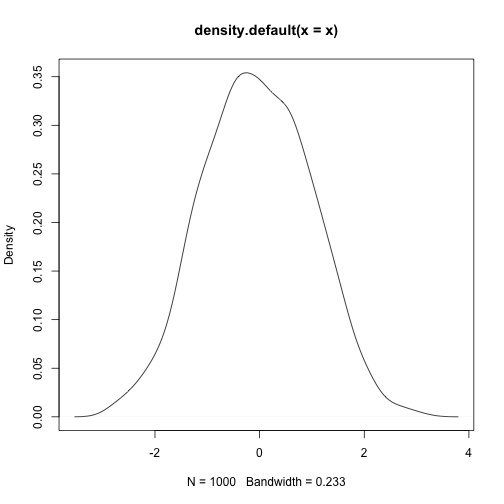

This is an R Markdown document.


```r
x <- rnorm(1000)
head(x)
```

```
## [1] -0.2569155  0.9110832  0.6181185  0.4479316 -0.2443289  0.4163217
```

`knitr` offers a lot of control over representing different
types of output. We can also have inline `R` expressions
computed on the fly.

The mean $\bar{x} = \frac{1}{n} \sum_{i=1}^{n} x_{i}$ of the
1000 random variates we generated is
-0.012.

This figure is computed on-the-fly as well. No more
copy-paste, including for figures:


```r
plot(density(x))
```


